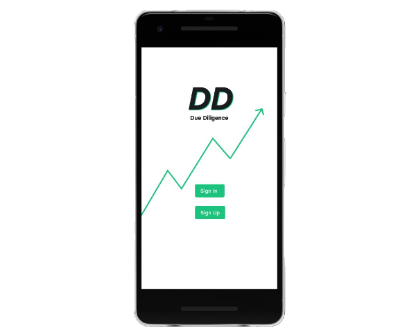
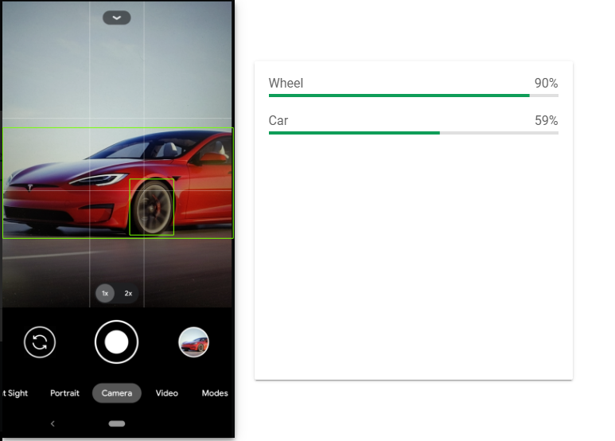
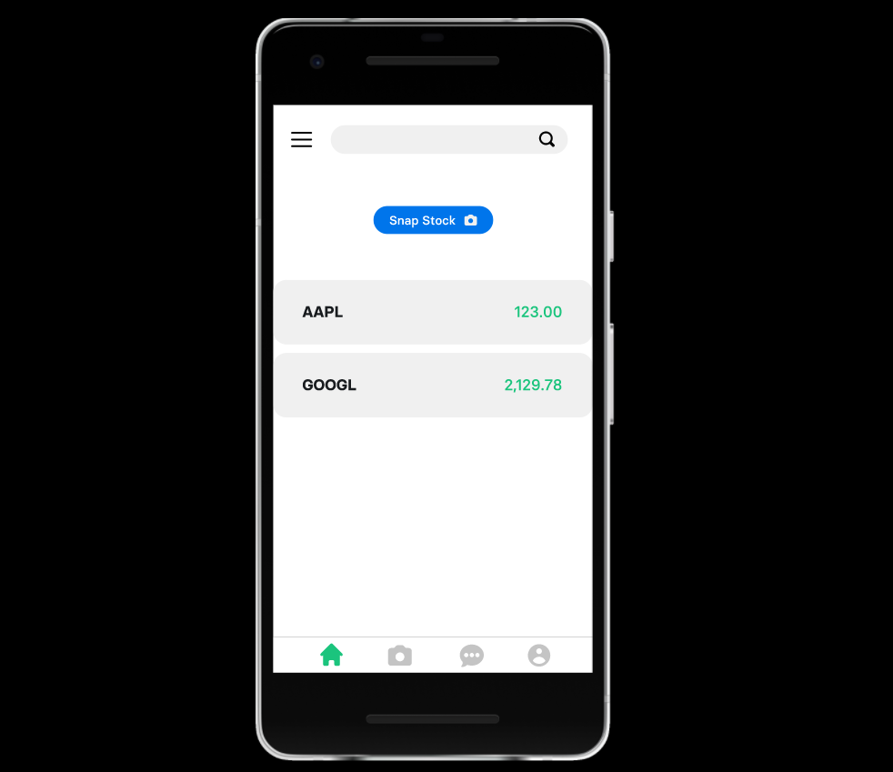
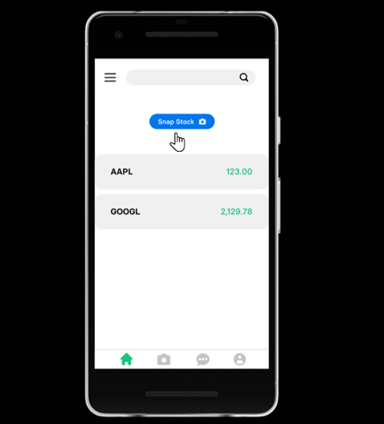
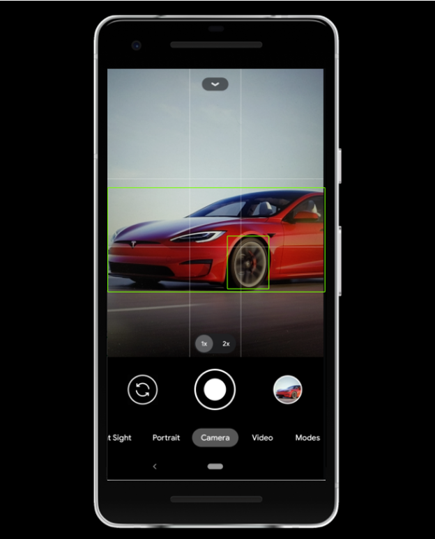

# DD - Due Diligence
 
## Concept

 DD - Due Diligence is a mobile application that enables users to learn about stocks and connecting with likeminded investors by snapping pictures.

**How Does it work?**


1. The user snaps a picture
2. The image is analysed using Google Cloud Vision  [ML Firebase Kit](https://firebase.google.com/docs/ml-kit) for mobile applications. 
3. The content of the image is labelled or detected. 
4. By using a [Bayesian Network Classifier](https://en.wikipedia.org/wiki/Bayesian_network) Model and [IEX Cloud API](https://iexcloud.io/docs/api/) the user is provided with a list of stocks and companies relevant to the object contained in the picture.

5. The user can choose to either take more pictures or chat with another DD investor. DD matches users taking into account investement style, favourire stocks and other information. DD suggestes up to 3 DD connections  at the time. 

## UI/UX 

- Sign up with your username, password and email address

- Log in using your username and password 

- Give DD your preference
DD will match you with users with similar interests 

- DD will suggest up to 3 users you can chat with. If you wish to connect with them you can add them to your frinds list! By editing your profile, updating your preference and by snapping more picture we can procide a better match! 


- Get Stock! 


- Snap


- Chat


## Backend 

### server.py

`server.py` is primarely use for users registration by connecting to the database using `MongoEngine()`. A payload from the front-end containing username, password and email is used to insert a new record in the detabase.

### src packages

The `./src` folder contains the following functions: 


### Database and Schema

We used MongoDB Free Tier (512MB) by following the instruction [here](https://docs.atlas.mongodb.com/tutorial/deploy-free-tier-cluster/), and for this mobile application we made use of two collections: 

- user: identity records of the users who are using Due Diligence
- histories: containing search history of the user 

Note to create the collection simply use the following command:

```
db.createCollection("<name collection>")

```


A user will have a record of the type:


```
{
    "_id": ObjectId("1279817381941duaiuj19837"),
    "username": "Princeton Hacker",
    "email": "user@hackprinceton.com",
    "password":"£$£&£%&$&%$*$*£%"%",
    "investmentstyle": "growth", 
    "investmenthorizon": "long term",  #or "short term
    "favourites":[
                "0" : "AAPL",
                "1" : "GOOG",
                "2" : "CVS"
    ],
    "friends":[
        "dd_id1",
        "dd_id2",
        ...
    ]
}
```

Whenever the user generates a serch, the history will be stored in `db.histories` with a dd_id corresponding to the "_id" of the user in the `User` collection. The `timestamp` will be used to fetch the history search of the user with respect to the most recent. The record will be of the type:

```

{
    "_id": ObjectId("2193619745bdga08217"),
    "userid":  "_id": ObjectId("1279817381941duaiuj19837"),
    "timestamp": ISODate("2019-01-31T10:00:00.000Z"),
    "stockname": "APPL"
}

```
The search is limited to 3-5 most recent searches, i.e. described by the query: 

```
db.Histories.aggregate([{$sort: {"timestamp":-1}}, {$limit:3}])

```

where `-1` is used to describe sort descending, from most recent and limit correspond to the number of records returned.

This functionality using 
```
from src.history import recent_search_history as fetch_history
```

### Vision API from Google Cloud

We have used  [Firebase ML Kit](https://firebase.google.com/docs/ml-kit/) for our Mobile application.
